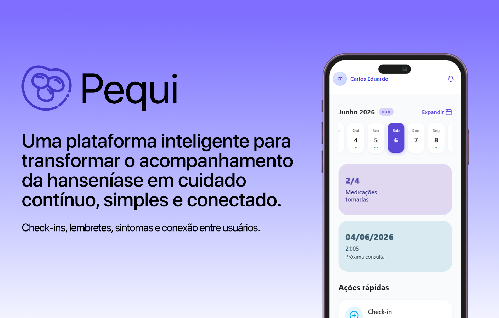

  

 

  
  <h1>Pequi</h1>
  
<strong>Plataforma de acompanhamento contínuo da hanseníase — do check-in diário ao painel do profissional.</strong>

---

## O problema

A hanseníase tem cura. O maior obstáculo não é o medicamento — é a adesão.

Pacientes abandonam o tratamento por falta de acompanhamento, esquecimento, efeitos adversos mal compreendidos e ausência de um canal direto com a equipe de saúde. Profissionais, por sua vez, dependem de cadernetas físicas, planilhas manuais e contato via WhatsApp para monitorar dezenas de casos simultaneamente.

O resultado: subnotificação, diagnóstico tardio de reações hansênicas e incapacidades físicas evitáveis.

---

## A solução

O Pequi conecta paciente e profissional em um fluxo clínico digital contínuo. O paciente registra doses, sintomas e bem-estar pelo celular. O profissional acompanha tudo em tempo real — sem planilhas, sem WhatsApp, sem lacunas no histórico.

| Para o paciente | Para o profissional |
|---|---|
| Check-in diário de medicação | Dashboard com adesão de todos os pacientes vinculados |
| Registro de sintomas e intensidade | Alertas automáticos quando a adesão cai ou sintomas escalam |
| Mapa corporal de lesões | Histórico clínico auditável e imutável |
| Conteúdo educativo sobre o tratamento | Vínculo formal com unidade de saúde |
| Comunidade anônima de apoio | Exportação de dados compatível com LGPD |

---

## Funcionalidades

**Adesão ao tratamento**
O paciente registra cada dose tomada. O sistema calcula automaticamente a taxa de adesão via snapshots diários e gera alertas para o profissional quando há ausência de check-in.

**Check-in com triagem de sintomas**
Junto ao registro da dose, o paciente informa sintomas como dormência, manchas, dor nos nervos e mal-estar. Quando a intensidade é alta, o sistema enfileira uma análise de feedback por IA e notifica o profissional.

**Mapa corporal**
Registro visual de lesões com histórico append-only — cada entrada é permanente e rastreável. Permite acompanhar a evolução das lesões ao longo do tratamento.

**Comunidade anônima**
Espaço para pacientes trocarem experiências com anonimato técnico garantido por arquitetura — não por política de uso.

**Artigos educativos**
Biblioteca de conteúdo clínico sobre o tratamento, efeitos adversos, cuidados com dormência e saúde sexual — curado pela equipe de saúde do projeto.

**LGPD by design**
Consentimento explícito na criação do perfil, exportação de dados em JSON, exclusão de conta com bloqueio automático quando há tratamento ativo, e blacklist de tokens no Redis.

---

## Contexto

O Pequi é desenvolvido por uma equipe interdisciplinar da Universidade Federal de Alagoas (UFAL). O projeto nasce da busca ativa de casos no município de Maceió (AL) — onde a incidência ainda é crítica — e tem como objetivo transformar o acompanhamento clínico de um processo reativo em um sistema contínuo, rastreável e centrado no paciente.

Ao negligenciar a hanseníase, o paciente se torna potencial foco da doença. O medo, o estigma e a omissão não podem levar ser contrários a uma solução que já exite.

---
